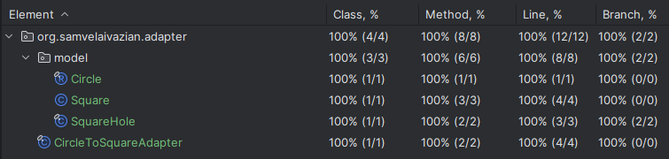

# Adapter Pattern Implementation in Java

## Project Description

This project implements the Adapter Pattern in Java. 
The Adapter Pattern is a structural design pattern that allows incompatible interfaces to work together. 
It wraps an existing class with a new interface so that it becomes compatible with the client's interface.
It addresses the problem described on [NeetCode](https://neetcode.io/problems/adapter).
The main goal of this project is to understand the implementation of the Adapter Pattern, 
thoroughly test it, and ensure it adheres to design principles.

## Problem Statement

Implement the Adapter design pattern.

The **_Adapter_** is a structural design pattern that allows incompatible interfaces to work together. 
It wraps an existing class with a new interface so that it becomes compatible with the client's interface.

You are given completed `SquareHole`, `Square`, and `Circle` classes. 
A `Square` fits into a `SquareHole` if the `Square`'s side length is less than or equal to the `SquareHole`'s length. 
A `Circle` has a radius, and a `Circle` fits into a `SquareHole` 
if the `Circle`'s diameter is less than or equal to the `SquareHole`'s length.

Complete the implementation of the `CircleToSquareAdapter` class such that it adapts a `Circle` to a `Square`.

### Classes and Interfaces

- **Circle**: Represents a circle with a specific radius.
- **Square**: Represents a square with a specific side length.
- **SquareHole**: Represents a square hole with a specific side length.
- **CircleToSquareAdapter**: Adapter class to adapt a `Circle` to a `Square`.

## Features

- Implementation of the Adapter Pattern to allow a `Circle` to fit into a `SquareHole`.
- Test cases to ensure the correctness and robustness of the adapter pattern.
- Full test coverage with 100% of classes and methods covered.
- Java 21 is used for the implementation.

## Classes and Methods

### Circle Class

1. **`Circle(double radius)`**
   - **Description**: Constructor to create a circle with a specific radius.
   - **Parameters**: `radius` - The radius of the circle.

### Square Class

1. **`Square()`**
   - **Description**: Default constructor for creating a square.
   - **Notes**: Needed for the Adapter pattern to allow for flexible instantiation.

2. **`Square(double sideLength)`**
   - **Description**: Constructor to create a square with a specific side length.
   - **Parameters**: `sideLength` - The side length of the square.

3. **`double getSideLength()`**
   - **Description**: Gets the side length of the square.

### SquareHole Class

1. **`SquareHole(double sideLength)`**
   - **Description**: Constructor to create a square hole with a specific side length.
   - **Parameters**: `sideLength` - The side length of the square hole.

2. **`boolean canFit(Square square)`**
   - **Description**: Checks if a given square can fit into this square hole.
   - **Parameters**: `square` - The square to check.
   - **Returns**: `true` if the square fits into the hole, `false` otherwise.

### CircleToSquareAdapter Class

1. **`CircleToSquareAdapter(Circle circle)`**
   - **Description**: Constructor for `CircleToSquareAdapter`.
   - **Parameters**: `circle` - The Circle instance to adapt.

2. **`double getSideLength()`**
   - **Description**: Gets the side length of the square that can encapsulate the circle.
   - **Returns**: The side length equivalent to the Circle's diameter.

## Testing

To ensure the correctness of the implementation, 
a comprehensive set of test cases is included in the `AdapterTest` class. 
The test cases verify the functionality of the adapter pattern 
and ensure that the `CircleToSquareAdapter` works correctly.

### Running Tests

To run the tests and see the assertion results, 
make sure to enable assertions by adding the `-ea` VM argument when running the tests.

### Test Coverage

All test cases pass successfully, and the code coverage is 100%.



## Requirements

- Java 21

## Usage

Clone the repository and navigate to the project directory. 
Compile the Java files and run the `AdapterTest` class to execute the tests.

```bash
javac -cp . org/samvelaivazian/adapter/*.java
java -ea org.samvelaivazian.adapter.AdapterTest
```

## Acknowledgements
This project was inspired by the problem description on [NeetCode](https://neetcode.io/).
The implementation and testing were done to deepen the understanding of data structures in Java,
particularly singly linked list.