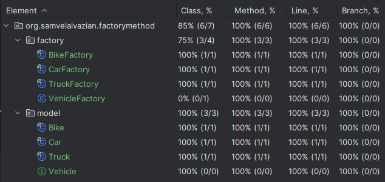

# Factory Method Pattern Implementation in Java

## Project Description

This project implements the Factory Method Pattern in Java. 
The Factory Method Pattern is a creational design pattern that provides an interface for creating objects 
in a superclass but allows subclasses to alter the type of objects that will be created.
It addresses the problem described on [NeetCode](https://neetcode.io/problems/factory).
The main goal of this project is to understand the implementation of the Factory Method Pattern, 
thoroughly test it, and ensure it adheres to design principles.

## Problem Statement

Implement the Factory Method design pattern.

The **_Factory Method_** is a creational design pattern that provides an interface for creating objects in a superclass 
but allows subclasses to alter the type of objects that will be created.

You are given code that includes a few vehicle types and their respective factories. 
Complete the factory method implementation such that each factory returns the correct vehicle.

### Classes and Interfaces

- **Vehicle**: Interface representing a generic vehicle.
- **Bike**: Class representing a bike.
- **Car**: Class representing a car.
- **Truck**: Class representing a truck.
- **VehicleFactory**: Abstract class defining the factory method.
- **BikeFactory**: Factory class for creating `Bike` objects.
- **CarFactory**: Factory class for creating `Car` objects.
- **TruckFactory**: Factory class for creating `Truck` objects.

## Features

- Implementation of the Factory Method Pattern with classes for different vehicle types.
- Test cases for each factory to ensure correctness and robustness.
- Full test coverage with 100% of classes and methods covered.
- Java 21 is used for the implementation.

## Classes and Methods

### Vehicle Interface

1. **`String getType()`**
   - **Description**: Returns the type of the vehicle.

### Bike, Car, Truck Classes

1. **`String getType()`**
   - **Description**: Returns the type of the vehicle (Bike, Car, Truck).

### VehicleFactory Abstract Class

1. **`Vehicle createVehicle()`**
   - **Description**: Abstract method to create a vehicle.

### BikeFactory, CarFactory, TruckFactory Classes

1. **`Vehicle createVehicle()`**
   - **Description**: Creates a specific vehicle (Bike, Car, Truck).

## Testing

To ensure the correctness of the implementation, 
a comprehensive set of test cases is included in the `FactoryMethodTest` class. 
The test cases verify the functionality of each factory and ensure that the correct vehicle objects are created.

### Running Tests

To run the tests and see the assertion results, make sure to enable assertions by adding the `-ea` VM argument when running the tests.

### Test Coverage

All test cases pass successfully, and the code coverage is 100%, as shown in the screenshot below:



**Note:** Due to the nature of abstract classes with only abstract methods, 
achieving 100% coverage might not be reflected in some coverage tools. 
For more details, refer to [Code Coverage Not Showing for Abstract Class with Only One Abstract Method](https://youtrack.jetbrains.com/issue/IDEA-355938/Code-Coverage-Not-Shows-the-Coverage-for-Abstract-Class-with-only-one-Abstract-Method).

## Requirements

- Java 21

## Usage

Clone the repository and navigate to the project directory. 
Compile the Java files and run the `FactoryMethodTest` class to execute the tests.

```bash
javac -cp . org/samvelaivazian/factorymethod/*.java
java -ea org.samvelaivazian.factorymethod.FactoryMethodTest
```

## Acknowledgements
This project was inspired by the problem description on [NeetCode](https://neetcode.io/).
The implementation and testing were done to deepen the understanding of data structures in Java,
particularly singly linked list.