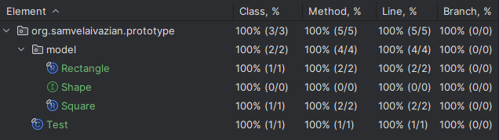

# Prototype Pattern Implementation in Java

## Project Description

This project implements the Prototype Design Pattern in Java.
The Prototype Pattern is a creational design pattern that allows cloning objects, even complex ones,
without coupling to their specific classes.
It involves creating new objects by copying an existing object, known as the prototype.
It addresses the problem described on [NeetCode](https://neetcode.io/problems/prototype).
The main goal of this project is to understand the implementation of the Prototype Pattern,
thoroughly test it, and ensure it adheres to design principles.

## Problem Statement

Implement the Prototype design pattern.

The **Prototype** is a creational design pattern that allows an object to copy itself.
It is particularly useful when the creation of an object is more convenient through copying an existing object
than through creation from scratch.

You are given a Shape prototype interface that supports cloning itself within the Rectangle and Square classes.

You need to implement the following:

- The `clone()` method in the `Rectangle` class which returns a new instance of the `Rectangle` class.
- The `clone()` method in the `Square` class which returns a new instance of the `Square` class.
- The `cloneShapes()` method in the `Test` class which returns a list of cloned shapes.

### Classes and Interfaces

- **Shape**: Interface representing a generic shape.
- **Rectangle**: Class representing a rectangle.
- **Square**: Class representing a square.

## Features

- Implementation of the Prototype Pattern with classes for different shape types.
- Test cases for each shape to ensure correctness and robustness.
- Full test coverage with 100% of classes and methods covered.
- Java 21 is used for the implementation.

## Classes and Methods

### Shape Interface

1. **`Shape clone()`**
    - **Description**: Creates a copy of the shape.

### Rectangle Class

1. **`Rectangle clone()`**
    - **Description**: Creates a copy of this rectangle.
    - **SuppressWarnings**: `{@code @SuppressWarnings({"CloneDoesntCallSuperClone", "RedundantSuppression"})}`
      is used to suppress warnings about the clone method not calling `super.clone()`
      and to avoid redundant suppression warnings.
        - **`CloneDoesntCallSuperClone`**: This warning indicates that the clone method should call `super.clone()`.
          However, for records, which are inherently immutable and final, calling `super.clone()` is not necessary.
          The clone method implementation here is correct because it creates a new instance of the record with
          the same values, which is enough for immutable types.
        - **`RedundantSuppression`**: This warning indicates that a suppression annotation is redundant.
          By combining this with `CloneDoesntCallSuperClone`, we explicitly acknowledge that the suppression is
          intentional
          and necessary due to the specific implementation of cloning for records.

### Square Class

1. **`Square clone()`**
    - **Description**: Creates a copy of this square.
    - **SuppressWarnings**: `{@code @SuppressWarnings({"CloneDoesntCallSuperClone", "RedundantSuppression"})}`
      is used to suppress warnings about the clone method not calling `super.clone()`
      and to avoid redundant suppression warnings.
        - **`CloneDoesntCallSuperClone`**: This warning indicates that the clone method should call `super.clone()`.
          However, for records, which are inherently immutable and final, calling `super.clone()` is not necessary.
          The clone method implementation here is correct because it creates a new instance of the record with
          the same values, which is enough for immutable types.
        - **`RedundantSuppression`**: This warning indicates that a suppression annotation is redundant.
          By combining this with `CloneDoesntCallSuperClone`, we explicitly acknowledge that the suppression is
          intentional
          and necessary due to the specific implementation of cloning for records.

### Test Class

1. **`List<Shape> cloneShapes(List<Shape> shapes)`**
    - **Description**: Clones a list of shapes.

## Testing

To ensure the correctness of the implementation,
a comprehensive set of test cases is included in the `PrototypeTest` class.
The test cases verify the functionality of each shape and ensure that the correct shape objects are cloned.

### Running Tests

To run the tests and see the assertion results, 
make sure to enable assertions by adding the `-ea` VM argument when running the tests.

### Test Coverage

All test cases pass successfully, and the code coverage is 100%, as shown in the screenshot below:



## Requirements

- Java 21

## Usage

Clone the repository and navigate to the project directory.
Compile the Java files and run the `PrototypeTest` class to execute the tests.

```bash
javac -cp . org/samvelaivazian/prototype/*.java
java -ea org.samvelaivazian.prototype.PrototypeTest
```

## Acknowledgements

This project was inspired by the problem description on [NeetCode](https://neetcode.io/).
The implementation and testing were done to deepen the understanding of data structures in Java,
particularly singly linked list.