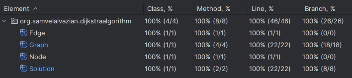

# Dijkstra's Algorithm Implementation in Java

## Project Description

This project is a Java implementation of Dijkstra's Algorithm for finding the shortest paths from a single source 
vertex to all other vertices in a graph with non-negative weights.
It addresses the problem described on [NeetCode](https://neetcode.io/problems/dijkstra).
The main goal of this project was to understand the intricacies of implementing Dijkstra's Algorithm from scratch, 
testing it thoroughly, and comprehending the time and space complexities associated with each operation. 
The implementation is done using clean Java, without any external libraries, to provide a fundamental understanding 
of the algorithm and its operations.

## Problem Statement

Implement Dijkstra's shortest path algorithm.

Given a weighted, directed graph, and a starting vertex, 
return the shortest distance from the starting vertex to every vertex in the graph.

### Input:

- `n` - the number of vertices in the graph, where (2 <= n <= 100). Each vertex is labeled from 0 to n - 1.
- `edges` - a list of tuples, each representing a directed edge in the form (u, v, w), 
where `u` is the source vertex, `v` is the destination vertex, and `w` is the weight of the edge, where (1 <= w <= 10).
- `src` - the source vertex from which to start the algorithm, where (0 <= src < n).

### Note:

If a vertex is unreachable from the source vertex, the shortest path distance for the unreachable vertex should be -1.

## Features

- Implementation of Dijkstra's Algorithm with initialization, shortest path calculation, and edge relaxation.
- Test cases for each method to ensure correctness and robustness.
- Full test coverage with 100% of classes and methods covered.
- Java 21 is used for the implementation.

## Methods

### Edge Class

1. **`Edge(int destinationVertex, int weight)`**
   - **Description:** Represents an edge in the graph with a destination vertex and a weight.
   - **Time Complexity:** `O(1)`
   - **Space Complexity:** `O(1)`

### Graph Class

1. **`Graph(int numberOfVertices, List<List<Integer>> edges)`**
   - **Description:** Constructs a graph with the specified number of vertices and edges.
   - **Time Complexity:** `O(V + E)`, where `V` is the number of vertices, and `E` is the number of edges.
   - **Space Complexity:** `O(V + E)`
   - **Throws:** `IllegalArgumentException` if the vertices count is out of the valid range 
   or edges contain invalid data.

2. **`Map<Integer, List<Edge>> getAdjacencyList()`**
   - **Description:** Returns the adjacency list of the graph.
   - **Time Complexity:** `O(1)`
   - **Space Complexity:** `O(1)`

### Node Class

1. **`Node(int distance, int vertex)`**
   - **Description:** Represents a node in the priority queue, containing the distance and the vertex.
   - **Time Complexity:** `O(1)`
   - **Space Complexity:** `O(1)`

### Solution Class

1. **`Map<Integer, Integer> shortestPath(int n, List<List<Integer>> edges, int src)`**
   - **Description:** Computes the shortest paths from the source vertex to all other vertices in the graph 
   using Dijkstra's Algorithm.
   - **Time Complexity:** `O((V + E) log V)`, where `V` is the number of vertices, and `E` is the number of edges.
   - **Space Complexity:** `O(V + E)`
   - **Throws:** `IndexOutOfBoundsException` if the source vertex is out of bounds.

## Testing

To ensure the correctness of the implementation, 
a comprehensive set of test cases is included in the `DijkstraAlgorithmTest` class. 
The test cases verify the functionality of each method and ensure edge cases are handled appropriately.

### Running Tests

To run the tests and see the assertion results, 
make sure to enable assertions by adding the `-ea` VM argument when running the tests.

### Test Coverage

All test cases pass successfully, and the code coverage is 100%, as shown in the screenshot below:



## Requirements

- Java 21

## Usage

Clone the repository and navigate to the project directory. 
Compile the Java files and run the `DijkstraAlgorithmTest` class to execute the tests.

```bash
javac -cp . org/samvelaivazian/dijkstraalgorithm/*.java
java -ea org.samvelaivazian.dijkstraalgorithm.DijkstraAlgorithmTest
```

## Acknowledgements
This project was inspired by the problem description on [NeetCode](https://neetcode.io/).
The implementation and testing were done to deepen the understanding of data structures in Java,
particularly singly linked list.