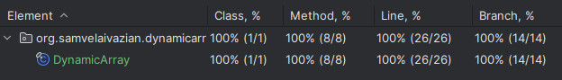

# Dynamic Array Implementation in Java

## Project Description

This project is a Java implementation of a dynamic array (resizable array).
It addresses the problem described on [NeetCode](https://neetcode.io/problems/dynamicArray).
The main goal of this project was to understand the intricacies of implementing a dynamic array from scratch, 
testing it thoroughly, and comprehending the time and space complexities associated with each operation. 
The implementation is done using clean Java, without any external libraries, to provide a fundamental understanding 
of the data structure and its operations.

## Problem Statement

Design a Dynamic Array (a.k.a. a resizable array) class, such as an ArrayList in Java or a vector in C++.

Your DynamicArray class should support the following operations:

1. **DynamicArray(int capacity)**
   - Initializes an empty array with a capacity of `capacity`, where `capacity > 0`.

2. **int get(int i)**
   - Returns the element at index `i`. The index `i` provided to `get(int i)` 
   is guaranteed to be greater than or equal to `0` and less than the number of elements in the array.

3. **void set(int i, int n)**
   - Sets the element at index `i` to `n`. The index `i` provided to `set(int i, int n)` 
   is guaranteed to be greater than or equal to `0` and less than the number of elements in the array.

4. **void pushBack(int n)**
   - Pushes the element `n` to the end of the array. If the array is full, it resizes the array first.

5. **int popBack()**
   - Pops and returns the element at the end of the array. Assumes that the array is non-empty.

6. **void resize()**
   - Doubles the capacity of the array.

7. **int getSize()**
   - Returns the number of elements in the array.

8. **int getCapacity()**
   - Returns the capacity of the array.

## Features

- Implementation of a dynamic array with insertion, retrieval, and removal operations.
- Test cases for each method to ensure correctness and robustness.
- Full test coverage with 100% of classes and methods covered.
- Java 21 is used for the implementation.

## Methods

### DynamicArray Class

1. **`DynamicArray(int capacity)`**
   - **Description:** Initializes an empty array with the specified capacity.
   - **Time Complexity:** `O(1)`
   - **Space Complexity:** `O(n)`, where `n` is the capacity.
   - **Throws:** `IllegalArgumentException` if the capacity is not positive.

2. **`int get(int i)`**
   - **Description:** Retrieves the value of the element at the specified index.
   - **Time Complexity:** `O(1)`
   - **Space Complexity:** `O(1)`
   - **Throws:** `IndexOutOfBoundsException` if the index is out of bounds.

3. **`void set(int i, int n)`**
   - **Description:** Sets the value of the element at the specified index to `n`.
   - **Time Complexity:** `O(1)`
   - **Space Complexity:** `O(1)`
   - **Throws:** `IndexOutOfBoundsException` if the index is out of bounds.

4. **`void pushBack(int n)`**
   - **Description:** Appends the specified element to the end of the array. 
   If the array is full, it resizes to accommodate the new element.
   - **Time Complexity:** Amortized `O(1)`
   - **Space Complexity:** `O(1)` for the new element, `O(n)` for the resize.
   - **Note:** Amortized time complexity means the average time per operation is `O(1)` 
   over a sequence of operations, even though individual operations (resizes) may take longer.

5. **`int popBack()`**
   - **Description:** Removes the element at the end of the array and returns it.
   - **Time Complexity:** `O(1)`
   - **Space Complexity:** `O(1)`
   - **Throws:** `NoSuchElementException` if the array is empty.

6. **`void resize()`**
   - **Description:** Doubles the capacity of the array. 
   This method is called internally when the array needs to be resized.
   - **Time Complexity:** `O(n)`
   - **Space Complexity:** `O(n)`

7. **`int getSize()`**
   - **Description:** Returns the number of elements in the array.
   - **Time Complexity:** `O(1)`
   - **Space Complexity:** `O(1)`

8. **`int getCapacity()`**
   - **Description:** Returns the current capacity of the array.
   - **Time Complexity:** `O(1)`
   - **Space Complexity:** `O(1)`

## Testing

To ensure the correctness of the implementation, 
a comprehensive set of test cases is included in the `DynamicArrayTest` class. 
The test cases verify the functionality of each method and ensure edge cases are handled appropriately.

### Running Tests

To run the tests and see the assertion results, 
make sure to enable assertions by adding the `-ea` VM argument when running the tests.

### Test Coverage

All test cases pass successfully, and the code coverage is 100%, as shown in the screenshot below:



## Requirements

- Java 21

## Usage

Clone the repository and navigate to the project directory. 
Compile the Java files and run the `DynamicArrayTest` class to execute the tests.

```bash
javac -cp . org/samvelaivazian/dynamicarray/*.java
java -ea org.samvelaivazian.dynamicarray.DynamicArrayTest
```

## Acknowledgements
This project was inspired by the problem description on [NeetCode](https://neetcode.io/).
The implementation and testing were done to deepen the understanding of data structures in Java,
particularly singly linked list.