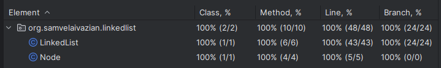

# Singly Linked List Implementation in Java

## Project Description

This project is a Java implementation of a singly linked list. 
It addresses the problem described on [NeetCode](https://neetcode.io/problems/singlyLinkedList). 
The main goal of this project was to understand the intricacies of implementing a linked list from scratch, 
testing it thoroughly, and comprehending the time and space complexities associated with each operation. 
The implementation is done using clean Java, without any external libraries, to provide a fundamental understanding 
of the data structure and its operations.

## Problem Statement

Design a Singly Linked List class.

Your LinkedList class should support the following operations:

1. **LinkedList()**
   - Initializes an empty linked list.

2. **int get(int i)**
   - Returns the value of the ith node (0-indexed). If the index is out of bounds, return `-1`.

3. **void insertHead(int val)**
   - Inserts a node with `val` at the head of the list.

4. **void insertTail(int val)**
   - Inserts a node with `val` at the tail of the list.

5. **boolean remove(int i)**
   - Removes the **i**th node (0-indexed). If the index is out of bounds, return `false`, otherwise return `true`.

6. **int[] getValues()**
   - Returns an array of all the values in the linked list, ordered from head to tail.

## Features

- Implementation of a singly linked list with insertion, retrieval, and removal operations.
- Test cases for each method to ensure correctness and robustness.
- Full test coverage with 100% of classes and methods covered.
- Java 21 is used for the implementation.

## Methods

### LinkedList Class

1. **`get(int index)`**
    - **Description:** Retrieves the value of the node at the specified index.
    - **Time Complexity:** `O(n)`
    - **Space Complexity:** `O(1)`
    - **Throws:** `IndexOutOfBoundsException` if the index is out of bounds.

2. **`insertHead(int value)`**
    - **Description:** Inserts a new node with the specified value at the head of the list.
    - **Time Complexity:** `O(1)`
    - **Space Complexity:** `O(1)`

3. **`insertTail(int value)`**
    - **Description:** Appends a new node with the specified value to the tail of the list.
    - **Time Complexity:** `O(1)`
    - **Space Complexity:** `O(1)`

4. **`remove(int index)`**
    - **Description:** Removes the node at the specified index if the index is valid.
    - **Time Complexity:** `O(n)`
    - **Space Complexity:** `O(1)`
    - **Returns:** `true` if the node was removed, `false` if the index is out of bounds.

5. **`getValues()`**
    - **Description:** Returns a list of all values in the linked list from head to tail.
    - **Time Complexity:** `O(n)`
    - **Space Complexity:** `O(n)`

### Node Class

1. **`getValue()`**
    - **Description:** Returns the value stored in the node.
    - **Time Complexity:** `O(1)`
    - **Space Complexity:** `O(1)`

2. **`getNext()`**
    - **Description:** Returns the next node in the linked list.
    - **Time Complexity:** `O(1)`
    - **Space Complexity:** `O(1)`

3. **`setNext(Node next)`**
    - **Description:** Sets the next node in the linked list.
    - **Time Complexity:** `O(1)`
    - **Space Complexity:** `O(1)`

## Testing

To ensure the correctness of the implementation, 
a comprehensive set of test cases is included in the `LinkedListTest` class. 
The test cases verify the functionality of each method and ensure edge cases are handled appropriately.

### Running Tests

To run the tests and see the assertion results, 
make sure to enable assertions by adding the `-ea` VM argument when running the tests.

### Test Coverage

All test cases pass successfully, and the code coverage is 100%, as shown in the screenshot below:



## Requirements

- Java 21

## Usage

Clone the repository and navigate to the project directory. 
Compile the Java files and run the `LinkedListTest` class to execute the tests.

```bash
javac -cp . org/samvelaivazian/linkedlist/*.java
java -ea org.samvelaivazian.linkedlist.LinkedListTest
```

## Acknowledgements
This project was inspired by the problem description on [NeetCode](https://neetcode.io/). 
The implementation and testing were done to deepen the understanding of data structures in Java, 
particularly singly linked list.
