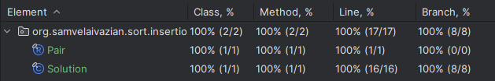

# Insertion Sort Implementation in Java

## Project Description

This project is a Java implementation of the insertion sort algorithm. 
It addresses the problem described on [NeetCode](https://neetcode.io/problems/insertionSort). 
The main goal of this project was to understand the intricacies of implementing the insertion sort algorithm 
from scratch, testing it thoroughly, and comprehending the time and space complexities associated with each operation. 
Additionally, by tracking the intermediate states of the array, the project provides insights into how the insertion 
sort algorithm progresses step by step. This project aims to provide a clear understanding of how insertion sort works 
and how it maintains stability during the sorting process. 
The implementation is done using clean Java, without any external libraries, to provide a fundamental understanding 
of the algorithm and its operations.

## Problem Statement

Implement Insertion Sort and return intermediate states.

Insertion Sort is a simple sorting algorithm that builds the sorted list one element at a time, 
from left to right. It works by repeatedly taking an element from the unsorted portion and inserting it 
into its correct position in the sorted portion of the list.

### Objective:

Given a list of key-value pairs, sort the list by key using Insertion Sort. 
Return a list of lists showing the state of the array after each insertion. 
If two key-value pairs have the same key, maintain their relative order in the sorted list.

## Features

- Implementation of insertion sort with intermediate states.
- Test cases for the method to ensure correctness and robustness.
- Full test coverage with 100% of classes and methods covered.
- Java 21 is used for the implementation.

## Methods

### Solution Class

1. **`List<List<Pair>> insertionSort(List<Pair> pairs)`**
    - **Description:** Sorts a list of Pair objects using the insertion sort algorithm. 
   Returns a list of lists showing the state of the array after each insertion.
    - **Time Complexity:** `O(n^2)` in the worst case, where `n` is the number of elements in the list.
    - **Space Complexity:** `O(n^2)` due to storing intermediate states of the list.
    - **Throws:** `IllegalArgumentException` if the list size exceeds 100.

### Pair Class

The `Pair` class is an immutable key-value pair where the key is an integer, and the value is a string. 
The class supports the following methods:

1. **`Pair(int key, String value)`**
    - **Description:** Initializes a pair with the specified key and value.
    - **Time Complexity:** `O(1)`
    - **Space Complexity:** `O(n)`, where `n` is the length of the string value.

2. **`int key()`**
    - **Description:** Returns the key of the pair.
    - **Time Complexity:** `O(1)`
    - **Space Complexity:** `O(1)`

3. **`String value()`**
    - **Description:** Returns the value of the pair.
    - **Time Complexity:** `O(1)`
    - **Space Complexity:** `O(1)`

4. **`String toString()`**
    - **Description:** Returns a string representation of the pair in the format (key, "value").
    - **Time Complexity:** `O(1)` for typical small strings, 
   potentially `O(n)` if the string is very large, where `n` is the length of the string.
    - **Space Complexity:** `O(1)`

## Testing

To ensure the correctness of the implementation, 
a comprehensive set of test cases is included in the `InsertionSortTest` class. 
The test cases verify the functionality of the insertion sort method and ensure edge cases are handled appropriately.

### Running Tests

To run the tests and see the assertion results, 
make sure to enable assertions by adding the `-ea` VM argument when running the tests.

### Test Coverage

All test cases pass successfully, and the code coverage is 100%, as shown in the screenshot below:



## Requirements

- Java 21

## Usage

Clone the repository and navigate to the project directory. 
Compile the Java files and run the `InsertionSortTest` class to execute the tests.

```bash
javac -cp . org/samvelaivazian/sort/insertion/*.java
java -ea org.samvelaivazian.sort.insertion.InsertionSortTest
```

## Acknowledgements
This project was inspired by the problem description on [NeetCode](https://neetcode.io/).
The implementation and testing were done to deepen the understanding of data structures in Java,
particularly singly linked list.